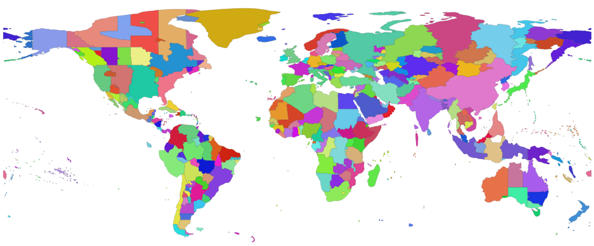

# Timezone Boundary Builder

The goal of this project is to produce a shapefile with the boundaries of the world's timezones using OpenStreetMap data.

<p align="center"></p>

## Shapefiles and data

The shapefiles are available for download in this project's [releases](https://github.com/evansiroky/timezone-boundary-builder/releases). Each shape or geojson object has a single attribute or property respectively called `tzid`.  The tzid corresponds to the timezone name as defined in the [timezone database](https://www.iana.org/time-zones) (for example: `America/Los_Angeles` or `Asia/Shanghai`).

This project aims to stay up-to-date with all of the currently valid timezones that are defined in the timezone database.  This project also will attempt to provide the most accurate possible boundaries of timezones according to community input.

The underlying data is download from [OpenStreetMap](http://www.openstreetmap.org/) via the [overpass turbo API](http://overpass-turbo.eu/).  Various boundaries are assembled together to produce each zone with various geographic operations.  In numerous edge cases arbitrary boundaries get created in various zones which are noted in the `timezones.json` file.

To maintain consistency with the timezone database, this project will only create a new release after the timezone database creates a new release.  If there are no new timezones created or deleted in a timezone database release, then this project will only create a release if there have been changes performed to the boundary definitions of an existing zone within this project.

## Running the script

It is possible to run the script to generate the timezones.  Due to the ever-changing nature of OpenStreetMap, the script can break when unexpected data is received.

**Run the script to generate timezones for all timezones.**

```shell
node --max-old-space-size=8192 index.js
```

**Run the script to generate timezones for only specified timezones.**

```shell
node --max-old-space-size=8192 index.js --filtered-zones "America/New_York,America/Chicago"
```

### What the script does

There are two config files that describe the boundary building process.  The `osmBoundarySources.json` file lists all of the needed boundaries to extract via queries to the Overpass API.  The `timezones.json` file lists all of the timezones and various operations to perform to build the boundaries.  The `index.js` file downloads all of the required geometries, builds the specified geometries, validates that there aren't large areas of overlap, outputs one huge geojson file, and finally zips up the geojson file using the `zip` cli and also converts the geojson to a shapefile using the `ogr2ogr` cli.  The script has only been verified to run with Node.js 6 on the MacOS platform.

The code does query the publicly available overpass API, but it self-throttles the making of requests to have a minimum of 4 seconds gap between requests.  If the Overpass API throttles the download, then the gap will be increased exponentially.

## Limitations of this project

The data is almost completely comprised of OpenStreetMap data which is editable by anyone.  There are a few educated guesses on where to draw an arbitrary border in the open waters and a few sparsely inhabited areas.  Some uninhabited islands are omitted from this project.  All of Antarctica is currently omitted as well.  This project also doesn't include any timezones in oceans except where the territorial waters of a country would apply.

## Contributing

Pull requests are welcome!  Please follow the guidelines listed below:

### Improvements to code

Will be approved subject to code review.

### Changes to timezone boundary configuration

Any change to the boundary of existing timezones must have some explanation of why the change is necessary.  If there are official, publicly available documents of administrative areas describing their timezone boundary please link to them when making your case.  All changes involving an administrative area changing their observed time should instead be sent to the [timezone database](https://www.iana.org/time-zones).

A linting script will verify the integrity of the `timezones.json` and `osmBoundarySources.json` files.  The script verifies if all needed overpass sources are properly defined and that there aren't any unneeded overpass downloads.  If an operation to make a timezone boundary requires the use of a manual geometry, a description must be added explaining the operation.

## Thanks

Thanks to following people whose open-source and open-data contributions have made this project possible:

- All the maintainers of the [timezone database](https://www.iana.org/time-zones).  
- Eric Muller for constructing and maintaining the timezone shapefile at [efele.net](http://efele.net/maps/tz/world/).  
- The [OpenStreetMap contributor Shinigami](https://www.openstreetmap.org/user/Shinigami) for making lots of edits in OpenStreetMap of various timezone boundaries.
- [Björn Harrtell](https://github.com/bjornharrtell) for all his work and help with [jsts](https://github.com/bjornharrtell/jsts).

## Licenses

The code used to construct the timezone boundaries is licensed under the [MIT License](https://opensource.org/licenses/MIT).

The outputted data is licensed under the [Open Data Commons Open Database License (ODbL)](http://opendatacommons.org/licenses/odbl/).
