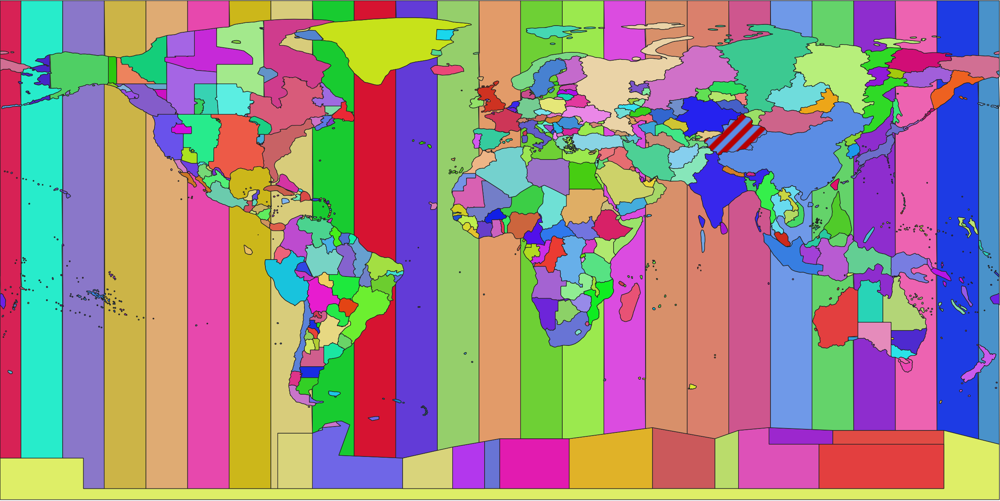

# Timezone Boundary Builder

The goal of this project is to produce a shapefile with the boundaries of the world's timezones using OpenStreetMap data.

<p align="center"></p>

[](https://tooomm.github.io/github-release-stats/?username=evansiroky&repository=timezone-boundary-builder) [](https://github.com/evansiroky/timezone-boundary-builder/releases/latest)

## Release data

The data is available for download in this project's [releases](https://github.com/evansiroky/timezone-boundary-builder/releases). Data from this project has been made available since October 2016.

### Relation to timezone database

This project produces regular releases of the approximate boundaries of the world's timezones. Each boundary is associated with a single timezone identifier as defined from the [timezone database](https://www.iana.org/time-zones) (for example: `America/Los_Angeles` or `Asia/Shanghai`). Each shape or GeoJSON object has a single attribute or property respectively called `tzid`.

### Release Numbering Scheme

This project aims to stay up-to-date with all of the currently valid timezones that are defined in the timezone database. This project also will attempt to provide the most accurate possible boundaries of timezones according to community input.

To maintain consistency with the timezone database, this project will only create a new release after the timezone database creates a new release.

**Important Note:** Some timezone database releases may not have a respective release from this project. New release are always created if a new timezones is created or deprecated in a timezone database release. For timezone database releases that don't have this trigger, then this project may create a release if there have been changes performed to the boundary definitions of an existing zone, or a bugfix is needed or a new feature is introduced. However, that may not always happen. Sometimes, certain timezone database releases are skipped if a new release from this project was still being worked on.

### Different Types of Releases

As of release 2023d, this project produces timezone boundary data products with three different variations:

1. Similarity of timekeeping method
2. With or without oceans
3. GeoJSON or Shapefile

Additionally, the input data used to assemble the releases and a list of timezone names are also included in each release.

#### 1. Similarity of timekeeping method

There are 3 different timekeeping similarity variations that are produced:

- Comprehensive
- Same since 1970
- Same since now

##### Comprehensive

This follows a strategy of including all timezone identifiers that were produced by the timezone database project according to the up-until 1993 practice of producing at least one zone per country. This does not include zones that were determined to be unneccessary due to lack of supporting evidence. This variation should mostly align with those timezones listed in the [zone.tab](https://github.com/eggert/tz/blob/main/zone.tab) file within the timezone database project. This dataset is the basis for producing the other 2 timekeeping variations in this project.

This output variation provides data assumes that some data about time changes prior to 1970 marked as deprecated within the timezone database is actually correct. Depending on whether the data prior to 1970 within the timezone database is deemed correct, then the use of this dataset will provide as comprehensive as possible data for observed timekeeping methods worldwide.

In the release files, these zones are identified with the prefix `timezones` or `timezones-with-oceans`. This was how timezones were orginally published by this project and has backwards compatibility with the methodology used to produce timezone database releases since this project started.

##### Same since 1970

This strategy merges timezones that have agreed on timekeeping methods since the year 1970. This results in a reduced set of timezones, simplified timezone polygons and smaller storage footprint. This variation should mostly align with those timezones listed in the [zone1970.tab](https://github.com/eggert/tz/blob/main/zone1970.tab) file within the timezone database project. However, the [@tubular/time](https://www.npmjs.com/package/@tubular/time) library is used to determine which zones get merged together from the comprehensive variation. The output of the zones from the comprehensive method are combined together for all relevant zones with the zone having the largest city population being used for the `tzid` of the merged zone in the final output.

This output variation is technically the most authoritative dataset since the timezone database officially supports only timekeeping methods that have been the same since 1970. Depending on whether the data prior to 1970 within the timezone database is deemed correct, then the use of this dataset may provide potentially incorrect data for observed timekeeping methods prior to 1970 at certain locations.

In the release files, these zones are identified with the prefix `timezones-1970` or `timezones-with-oceans-1970`. Data with the "Same since 1970" timekeeping method was first made availabile in release 2023d.

##### Same since now

This strategy merges timezones that agree on timekeeping methods as of the approximate release date of the data. This results in a reduced set of timezones, simplified timezone polygons and smaller storage footprint. This variation should mostly align with those timezones listed in the [zonenow.tab](https://github.com/eggert/tz/blob/main/zonenow.tab) file within the timezone database project. However, the [@tubular/time](https://www.npmjs.com/package/@tubular/time) library is used to determine which zones get merged together from the comprehensive variation. The output of the zones from the comprehensive method are combined together for all relevant zones and the zone with the largest city population is used in the final output.

This output variation is only suitable for use cases that need to know the current or future time at a location. It will provide potentially incorrect data for observed timekeeping methods in the past at certain locations.

In the release files, these zones are identified with the prefix `timezones-now` or `timezones-with-oceans-now`. Data with the "Same since now" timekeeping method was first made availabile in release 2023d.

#### 2. With or without oceans

In combination with the timekeeping method variations, there are two additional variations based on the inclusion of ocean zones. The first variation does not include any ocean zones in the output. The second variation does include ocean zones in the output from `Etc/GMT+12` to `Etc/GMT-12`.

A common misconception is that `Etc/GMT*` zones should increase from west to east, however, this is not the case as explained in the [timezone database in the etcetera file](https://github.com/eggert/tz/blob/92a7a4c5faca48742698d7e3fb5d80f27d7408e0/etcetera#L37-L43):

```code
# Be consistent with POSIX TZ settings in the Zone names,
# even though this is the opposite of what many people expect.
# POSIX has positive signs west of Greenwich, but many people expect
# positive signs east of Greenwich.  For example, TZ='Etc/GMT+4' uses
# the abbreviation "-04" and corresponds to 4 hours behind UT
# (i.e. west of Greenwich) even though many people would expect it to
# mean 4 hours ahead of UT (i.e. east of Greenwich).
```

In the release files, the files that have oceans are specifically noted as having them due to having the string `with-oceans` within the filename. Release files without this string do not have ocean data. Data with or without oceans was first made availabile in release 2018d.

#### 3. GeoJSON or Shapefile

In combination with the timekeeping method and ocean variations, each of these combinations is outputted as either GeoJSON or a shapefile. In both cases, each of these release types are made available in a zip file.

In the release files, the files that are provided in GeoJSON have the suffix `.geojson.zip`. The shapefiles have the suffix `.shapefile.zip`. Release files have been provided in GeoJSON or as shapefiles in releases since this project started.

#### timezone-names.json

This release file is simply a single array with the list of timezone identifiers used to create the comprehensive release of timezone data. This has been included in releases starting from release 2019b.

#### input-data.zip

Each release includes the input and cached data used to generate the timezone boundary files. This includes the raw data downloaded from OpenStreetMap and the definition files within this project at the time of the release. Additionally, as of 2023d it also includes the cached data to facilitate quicker recomputation. The preparation phase of each release is so far still manual and therefore may include files downloaded on different days. This has been included in releases starting from release 2020a.

### Source of Data

The underlying data is downloaded from [OpenStreetMap](http://www.openstreetmap.org/) via the [overpass turbo API](http://overpass-turbo.eu/). Various boundaries are assembled together to produce each zone with various geographic operations. In numerous edge cases arbitrary boundaries get created in various zones which are noted in the `timezones.json` file.

Within OpenStreetMap there exist a lot of data about timezone boundaries. A lot of the timezone boundaries exist by piggy-backing on top of existing administrative boundary relations, however some timezone boundaries have their own dedicated relations. Some of these relations are pulled in verbatim by this project.

Shortly after this project began in the year 2017, there was controversy on the [OpenStreetMap mailing list](https://lists.openstreetmap.org/pipermail/tagging/2017-March/031453.html) about whether timezone relations should exist in OpenStreetMap. Since then, the timezone relations in OpenStreetMap have remained and improved in quality. Also, recently the [OpenStreetMap wiki page Key:timezone](https://wiki.openstreetmap.org/wiki/Key:timezone) was updated to include great instructions on how to map timezone boundaries.

Given this stability, improvement in quality, and documentation, it is the intent of this project to rely more heavily on the timezone data from OpenStreetMap. In future releases, more boundaries will have their definitions come directly from overpass searches for timezone key/value pairs in OpenStreetMap. This project will continue to quality-control the resulting worldwide data prior to releasing.

## Lookup Libraries

A few common languages already have libraries with an API that can be used to lookup the timezone name at a particular GPS coordinate. Here are some libraries that use the data produced by timezone-boundary-builder:

| Language                            | Library                                                                                  |
| ----------------------------------- | ---------------------------------------------------------------------------------------- |
| C                                   | [ZoneDetect](https://github.com/BertoldVdb/ZoneDetect)                                   |
| Elixir                              | [tz_world](https://hex.pm/packages/tz_world)                                             |
| Go                                  | [timezoneLookup](https://github.com/evanoberholster/timezoneLookup)                      |
| Go                                  | [tzf](https://github.com/ringsaturn/tzf)                                                 |
| Java & Android                      | [TimeZoneMap](https://github.com/dustin-johnson/timezonemap)                             |
| Java                                | [Timeshape](https://github.com/RomanIakovlev/timeshape)                                  |
| JavaScript (node.js only)           | [node-geo-tz](https://github.com/evansiroky/node-geo-tz/)                                |
| JavaScript (node.js and in browser) | [timespace](https://github.com/mapbox/timespace)                                         |
| JavaScript (node.js and in browser) | [tz-lookup](https://github.com/darkskyapp/tz-lookup-oss)                                 |
| JavaScript (browser only)           | [browser-geo-tz](https://github.com/kevmo314/browser-geo-tz/)                            |
| JavaScript (browser only)           | [tzf-wasm](https://github.com/ringsaturn/tzf-wasm)                                       |
| Julia                               | [TimeZoneFinder](https://github.com/tpgillam/TimeZoneFinder.jl)                          |
| .NET                                | [GeoTimezone](https://github.com/mj1856/GeoTimeZone)                                     |
| .NET                                | [TZFinder](https://github.com/devsko/TZFinder)                                           |
| Perl                                | [Geo::Location::TimeZoneFinder](https://github.com/voegelas/Geo-Location-TimeZoneFinder) |
| php                                 | [Geo-Timezone](https://github.com/minube/geo-timezone)                                   |
| Python                              | [timezonefinder](https://github.com/MrMinimal64/timezonefinder)                          |
| Python                              | [tzfpy](https://github.com/ringsaturn/tzfpy)                                             |
| R                                   | [lutz](https://github.com/ateucher/lutz)                                                 |
| Ruby                                | [tzf-rb](https://github.com/HarlemSquirrel/tzf-rb)                                       |
| Ruby                                | [wheretz](https://github.com/zverok/wheretz)                                             |
| Rust                                | [tzf-rs](https://github.com/ringsaturn/tzf-rs)                                           |
| Rust                                | [rtz](https://github.com/twitchax/rtz)                                                   |
| Swift                               | [tzf-swift](https://github.com/ringsaturn/tzf-swift)                                     |

Another common way to use the data for lookup purposes is to load the shapefile into a spatially-aware database. See this [blog post](https://simonwillison.net/2017/Dec/12/location-time-zone-api/) for an example of how that can be done.

Data Warehouses:

| Data Warehouse | Public Dataset                                              |
| -------------- | ----------------------------------------------------------- |
| BigQuery       | [tz-data](https://github.com/redorkulated/bigquery-tz-data) |

Database Extensions:

| Database   | Libraries                                      |
| ---------- | ---------------------------------------------- |
| PostgreSQL | [pg-tzf](https://github.com/ringsaturn/pg-tzf) |

## Running the script

If the data in the releases are not sufficiently recent or you want to build the latest from master, it is possible to run the script to generate the timezones. However, due to the ever-changing nature of OpenStreetMap, the script should be considered unstable. The script frequently breaks when unexpected data is received or changes in OpenStreetMap cause validation issues. Please see the [troubleshooting guide](https://github.com/evansiroky/timezone-boundary-builder/wiki/Troubleshooting) for help with common errors.

**Run the script to generate timezones for all timezones.**

```shell
node --max-old-space-size=8192 index.js
```

**Run the script to generate timezones for only specified timezones.**

```shell
node --max-old-space-size=8192 index.js --included_zones America/New_York America/Chicago
```

**Run the script to generate timezones while excluding specified timezones.**

```shell
node --max-old-space-size=8192 index.js --excluded_zones America/New_York America/Chicago
```

**Run the script with custom working / output directories.**

timezone-boundary-builder downloads boundaries from OpenStreetMap and places them in the `./downloads` directory. It writes various intermediate files to `./working`. All files included in releases are written to the `./dist` directory.

If you want to use different directories, you can do so with the `--downloads_dir`, `--dist_dir` and `--working_dir` flags.

```shell
node --max-old-space-size=8192 index.js --downloads_dir ./downloads2 --dist_dir ./dist2 --working_dir ./working2
```

**All command line flags**

- `--help` - Show some basic usage information.
- `--cache_dir` - The directory to read/save cached calculation files to. (Defualts to `./cache`)
- `--dist_dir` - The directory to save release files to. (Defualts to `./dist`)
- `--downloads_dir` - The directory to save raw downloaded files to. (Defualts to `./downloads`)
- `--excluded_zones` - A list of timezone identifiers to exclude when building.
- `--included_zones` - An allow-list of timezone identifiers to only include when building. (if excluded zones are provided, those will be removed from this list)
- `--skip_1970_zones` - Skips the building of zones with the same timekeeping method since 1970.
- `--skip_now_zones` - Skips the building of zones with the same timekeeping method since the time when the script is ran.
- `--skip_analyze_diffs` - Skips analyzing differences between the current output and the previous release,
- `--skip_analyze_osm_tz_diffs` - Skips the downloading of all OSM data for timezone relations that are not directly used to in this project's boundary building config. Also skips analyzing the differences between timezone-boundary-builder output and raw OSM timezone relations.
- `--skip_shapefile` - Skips creating a shapefile output for all release data products.
- `--skip_validation` - Skips all validation checks of the time zone boundaries.
- `--skip_zip` - Skips the zipping of the release files.
- `--working_dir` - The directory to save intermediate calculation files to. (Defualts to `./working`)

### What the script does

There are three config files that describe the boundary building process. The `osmBoundarySources.json` file lists all of the needed boundaries to extract via queries to the Overpass API. The `timezones.json` file lists all of the timezones and various operations to perform to build the boundaries. The `expectedZoneOverlaps.json` file lists all timezones that are allowed to overlap each other and the acceptable bounds of a particular overlap.

The `index.js` file downloads all of the required geometries, builds the specified geometries, validates that there aren't large areas of overlap (other than those that are expected), analyzes the difference between the current output and the last release, outputs one huge geojson file, and finally zips up the geojson file using the `zip` cli and also converts the geojson to a shapefile using the `ogr2ogr` cli. The script has only been verified to run with Node.js 10 on the MacOS platform.

The code does query the publicly available Overpass API, but it self-throttles the making of requests to have a minimum of 4 seconds gap between requests. If the Overpass API throttles the download, then the gap will be increased exponentially.

The validation and difference analysis can take a really long time to compute. If these tasks are not needed, be sure to add the `--skip_analyze_diffs` and `--skip_validation` flags.

As of release 2020a, it is possible to run the script with the underlying input data that was used to build the timezone geometries at the time of the release. In the release files, the `input-data.zip` will have all of the necessary input data including the downloaded files from overpass, the `timezones.json` file and the `osmBoundarySources.json` file as well.

## Limitations of this project

The data is almost completely comprised of OpenStreetMap data which is editable by anyone. There are a few guesses on where to draw an arbitrary border in the open waters and a few sparsely inhabited areas. Some uninhabited islands are omitted from this project. This project does include timezones in the oceans, but strictly uses territorial waters and not Exclusive Economic Zones.

## Contributing

Pull requests are welcome! Please follow the guidelines listed below:

### Improvements to code

Will be approved subject to code review.

### Changes to timezone boundary configuration

Any change to the boundary of existing timezones must have some explanation of why the change is necessary. If there are official, publicly available documents of administrative areas describing their timezone boundary please link to them when making your case. All changes involving an administrative area changing their observed time should instead be sent to the [timezone database](https://www.iana.org/time-zones).

A linting script will verify the integrity of the `timezones.json`, `osmBoundarySources.json` and `expectedZoneOverlaps.json` files. The script verifies if all needed overpass sources are properly defined and that there aren't any unneeded overpass downloads. If an operation to make a timezone boundary requires the use of a manual geometry, a description must be added explaining the operation. All expected zone overlaps must have a description.

## Thanks

Thanks to following people whose open-source and open-data contributions have made this project possible:

- All the maintainers of the [timezone database](https://www.iana.org/time-zones).
- Eric Muller for constructing and maintaining the timezone shapefile at [efele.net](http://efele.net/maps/tz/world/).
- OpenStreetMap contributors, with a special shoutout to [OpenStreetMap contributor Shinigami](https://www.openstreetmap.org/user/Shinigami) for making lots of edits in OpenStreetMap of various timezone boundaries.
- [Björn Harrtell](https://github.com/bjornharrtell) for all his work and help with [jsts](https://github.com/bjornharrtell/jsts).

## Licenses

The code used to construct the timezone boundaries is licensed under the [MIT License](https://opensource.org/licenses/MIT).

The outputted data is licensed under the [Open Data Commons Open Database License (ODbL)](http://opendatacommons.org/licenses/odbl/).
